# Forum 论坛系统
本项目是一个 “故事 + 帖子” 双内容形态的轻量级内容创作与分享平台,为用户提供一站式内容创作入口：支持长文故事（富文本编辑、分类管理、封面上传）和短内容帖子的发布，满足不同场景的创作需求,实现点赞、评论、收藏等核心互动功能，让创作者获得反馈，让读者参与讨论，提升内容生命力。
## 技术栈：
### 一、前端框架vue3，前端核心框架，采用组合式API提升代码复用性和可维护性
vue-Router：实现路由管理、路由守卫等功能
Pinia：实现全局状态（如用户信息、登录态）的统一管理功能
Axios:实现前后端数据交互等功能
vite：前端构建工具，速度更快
echarts:数据可视化库，提供数据统计图表
TinyMCE：富文本编辑器（帖子内容）
### 二、后端框架express 5.1，轻量级node.js框架，处理路由分发、业务逻辑处理、中间件管理等功能
JWT：实现无状态身份认证、为API请求提供安全校验等功能
Multer：处理文件上传请求、支持头像、附件上传等文件的接收以及本地存储
Sequelize: ORM框架,提升数据库操作效率
### 三、数据库 MySQL 8+：关系型数据库，用于存储用户、帖子、评论等核心数据
### 四、静态资源存储 通过 Express 静态资源中间件托管，对外提供访问接口。
### 五、功能概览
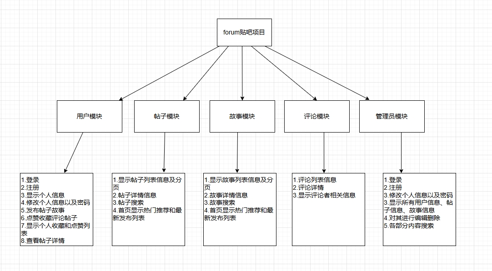
### 六、运行截图
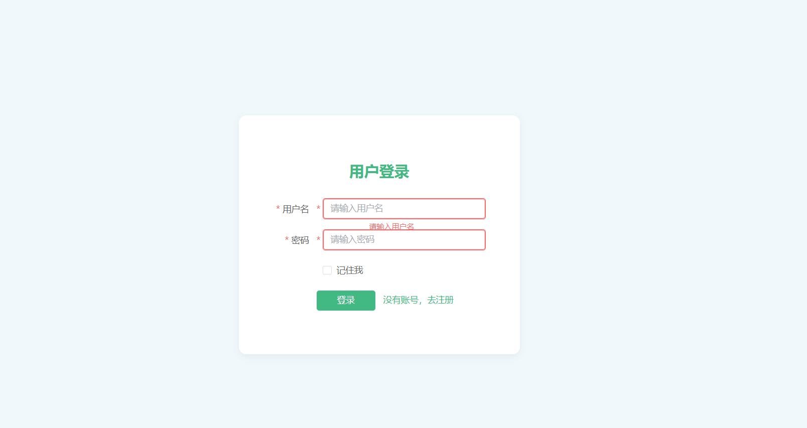
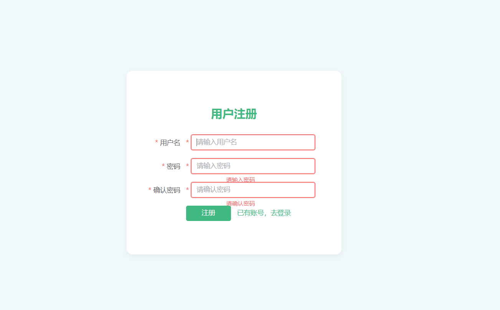
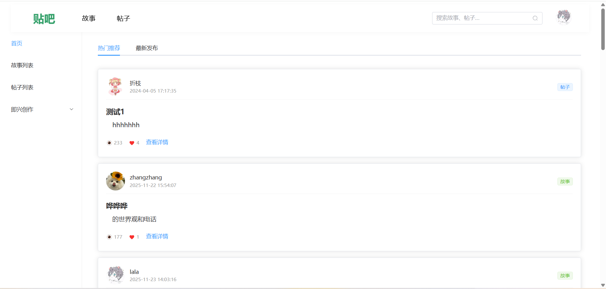
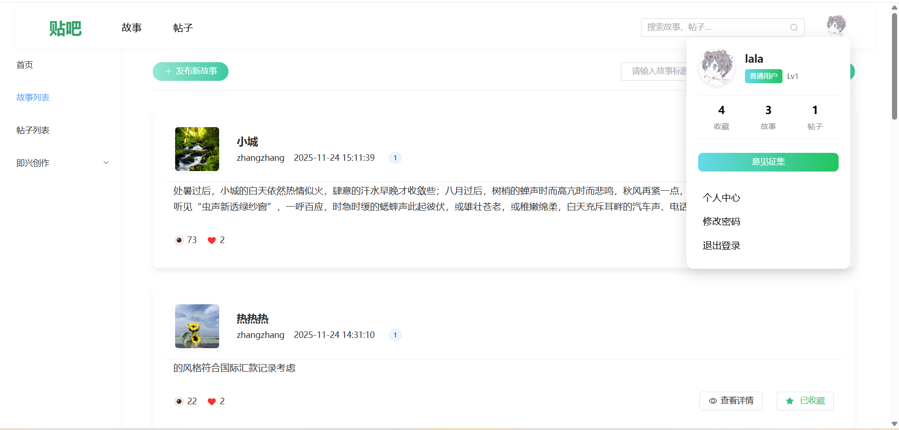
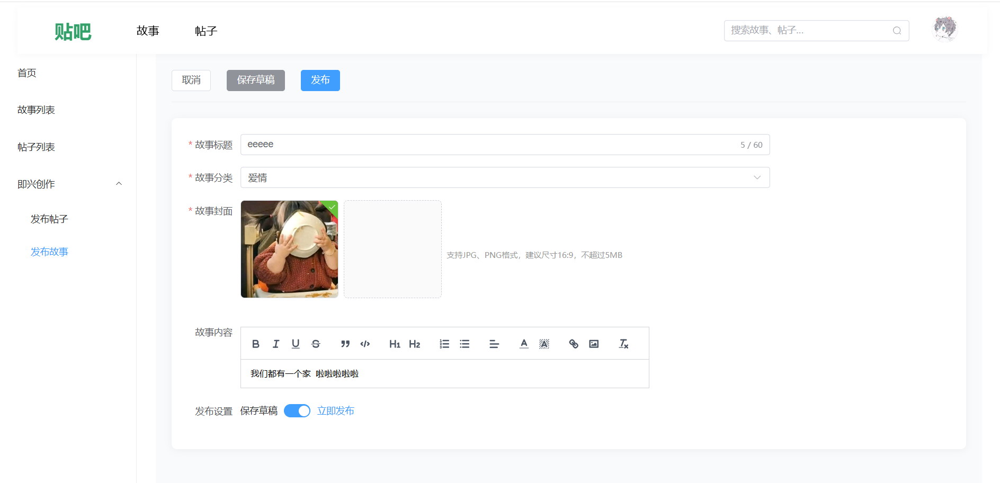
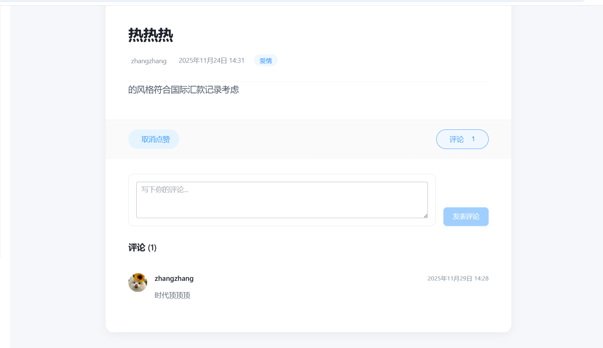
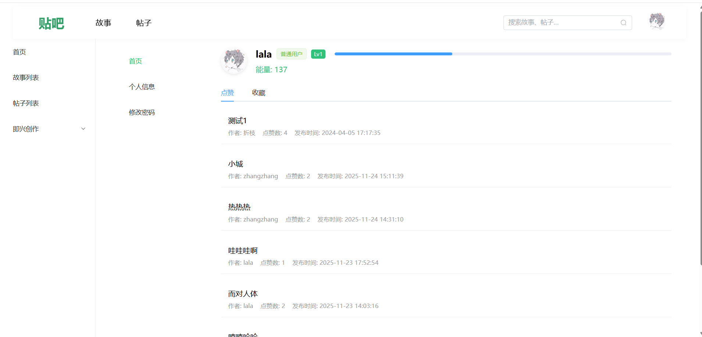
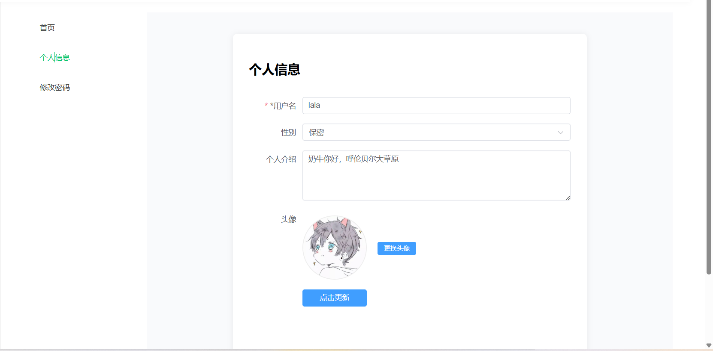
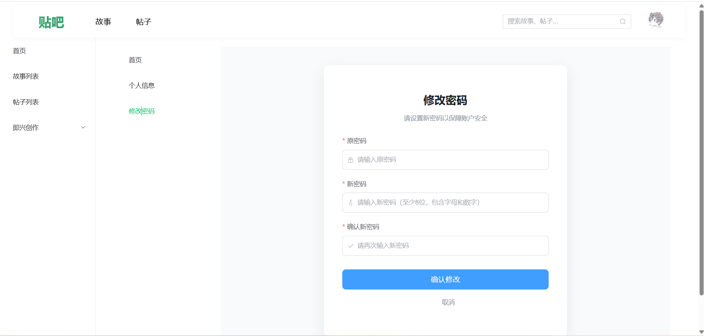
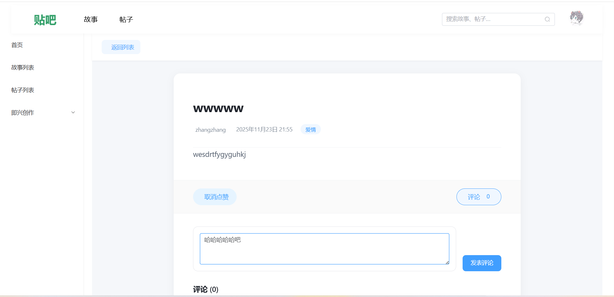
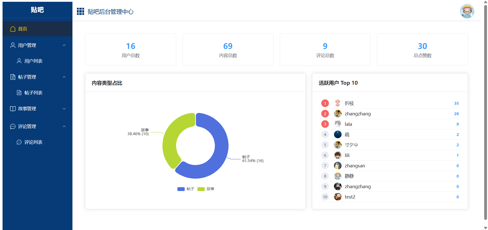
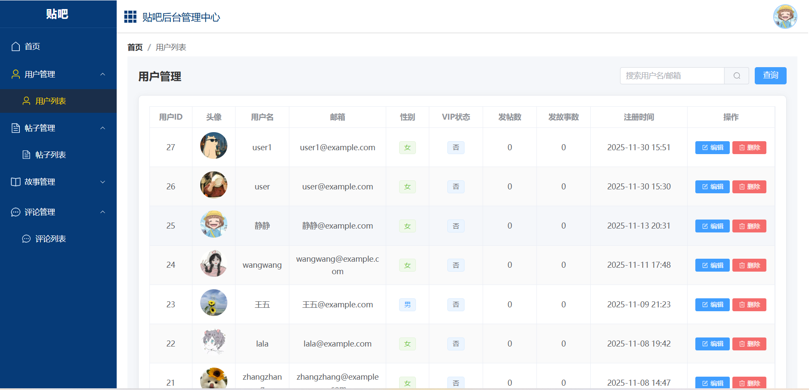
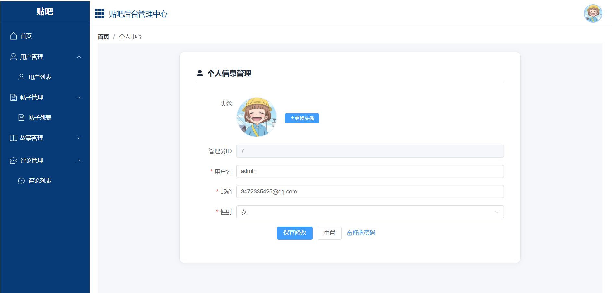

